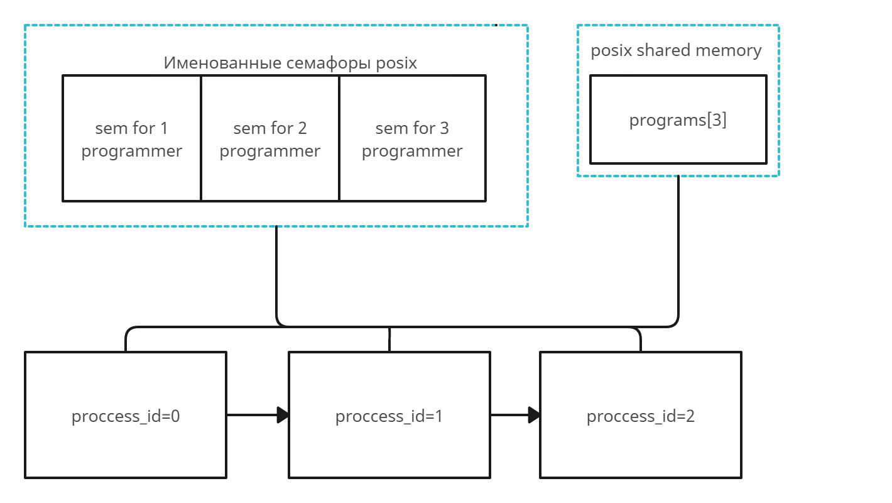
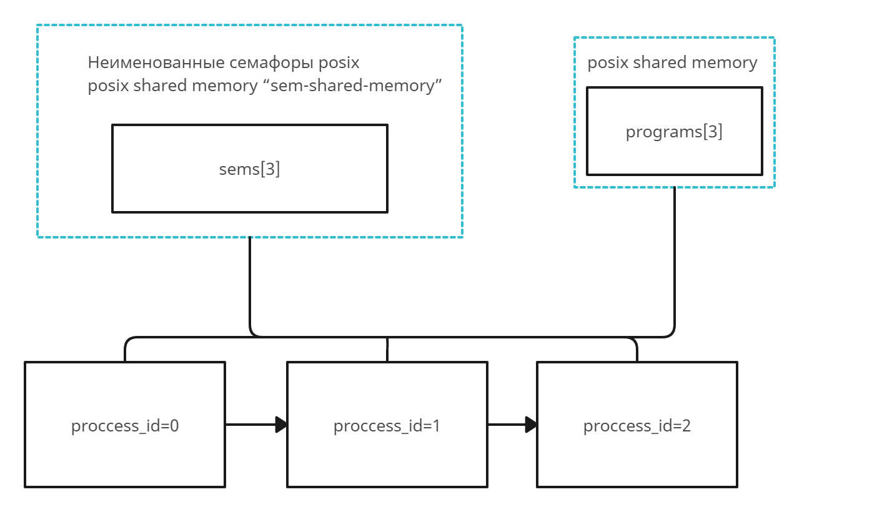
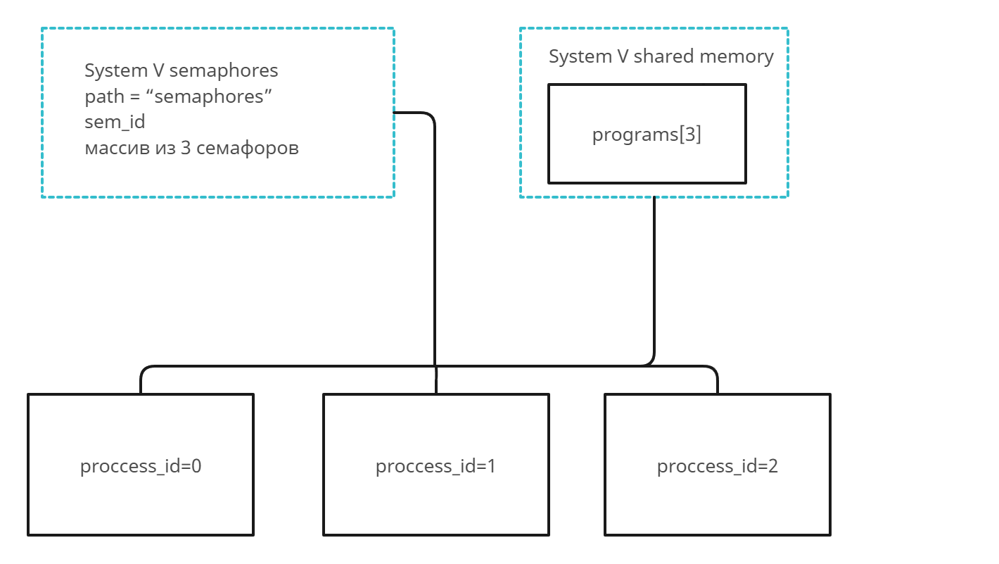

# Индивидуальное домашнее задание №2, Вариант 21
## **Исполнитель**: Копырина Полина Ивановна, группа БПИ213

## **Условие задачи**: Задача о программистах.
В отделе работают три программиста. Каждый программист пишет свою программу и отдает ее на
проверку другому случайному программисту. Программист переключается на проверку чужой программы, когда его собственная
уже написана и передана на проверку. По завершении проверки,
программист возвращает программу с результатом (формируемым случайно по любому из выбранных Вами законов):
программа написана правильно или неправильно. Программист спит, если отправил свою программу и не проверяет чужую программу. Программист просыпается, когда получает заключение от другого программиста. Если программа признана правильной, программист пишет
другую программу, если программа признана неправильной, программист исправляет ее и отправляет на проверку тому же программисту, который ее проверял. К исправлению своей программы он приступает, завершив проверку чужой программы. Проверки и
коррекции одной программы могут проходить многократно (правильность программы задается случайным образом). При наличии
в очереди проверяемых программ и приходе заключения о неправильной своей программы программист может выбирать любую из
возможных работ. Создать приложение, моделирующее работу программистов. Каждый программист задается отдельным процессом.


## **Реализованные программы**:

### Общая схема решения:

В каждом решении при запуске программы должно создаваться три процесса (родственных или независимых, зависит от решения).
Каждый процесс соответствует одному программисту. Виды деятельности программистов не индивидуальны (каждый из программистов должен
писать свой код, проверять чужой код и исправлять свой код), и все эти деятельности цикличны, поэтому была создана функция
`do_your_business`, которая и "запускает" жизнедеятельность каждого программиста. 

Как уже говорилось, у программиста всего может быть 3 вида деятельности: 
написание своего кода, ревью чужого, и исправление замечаний после ревью. Все эти виды деятельности оформлены в отдельные функции: `write_program`,  `review_program`, `fix_program` соответственно. Перед началом и после окончания каждой из этих деятельностей процесс выводит информацию об этом в консоль (чтобы пользователь мог отслеживать, что происходит). Скорость выполнения каждой из трех функций задает пользователь при запуске программы через аргументы командой строки.

Информация, которой обмениваются процессы-программисты это состояние программ (например, программа сейчас пишется, программа на ревью и т.д.). 
Поэтому в разделяемой памяти хранится массив из трех элементов, где i-ый элемент - это состояние программы, которую пишет программист i.
Так как у каждого из 3 программистов не может быть в работе больше одной программы (а нас интересуют только задачи, которые еще не завершены), то каждую незавершенную программу можно смело идентифицировать по номеру её автора - от 1 до 3 (или от 0 до 2, если индексация с 0). Каждая запись о статусе программы содержит две переменные - сам статус (`enum program_status`) и id её ревьюера (id автора это порядковый номер записи в массиве).

Изначально хотелось использовать семафоры для ограничения доступа к работе над ресурсом - "программой". Но тогда процесс-программист мог бы висеть заблокированным, ожидая пока другой программист закончит свою работу над кодом, игнорируя другие уже открытые к работе задачи, что не очень хорошо (например, процесс ждет исправлений кода, чтобы снова отревьюить его, хотя к нему пришла задача по исправлению собственного кода, но он её не делает и просто ждет доступа к другой задаче).

Поэтому в этой задаче я использовала семафоры в менее классическом способе их применения. В данномм сценарии семафоры - это "уведомления" для каждого процесса-программиста. Всего 3 семафора, каждый соответствует одному из 3 процессов. 
Если для какого-то процесса появляется работа (нужно отревьюить чужой код, исправить свой код, начать писать новую программу) - значение семафор этого процесса увеличивается. 
Таким образом, значение i-ого семафора - это количество невыполненных задач для i-ого программиста. Каждый процесс бесконечно что-то делает в цикле, где одна итерация - это одно действие.

Если значение семафора больше 0, то процесс просматривает все записи и идентифицирует ту, которую ему нужно сделать (проревьюить задачу, исправить программу, написать новую), уменьшая значение семафора. Причем приоритет ревью и исправления ошибки больше чем написание новой программы. Если же значение семафора = 0, то процесс блокируется в самом начале итерации и "спит", пока у него не появится работа.

Теперь про завершение программы - "главным" процессом является процесс с id 0 (каждому процессу проставляется id от 0 до 2). При завершении программы именно этот процесс окончательно удаляет разделяемую память и семафоры.

По условию задачи моделирование процессов может продолжаться бесконечно, у него нет конца и края, поэтому в данной задаче самым главным и удобным способом остановить программу является cntl+C (^C). Для этого был написан обработчик сигнала, действующий для всех процессов.

#### **Запуск и формат ввода**
В папке для каждого решения есть bash скрипт (test-input.sh), который компилирует программу и запускает её с какими-то входными параметрами (для программ на 7-8 таких скриптов 3 из-за того, что процессы независимы).
В нем можно посмотреть пример компиляции и запуска программы, но приведем это и тут:
```
gcc main.c -o main -lpthread -lrt
./main 5 2 3
```
Программа принимает на вход 3 целых числа, каждое из которых задает время выполнения программистом одного из трех действий:
1) написание программы с нуля
2) ревью чужой программы
3) исправление ошибок в своей программе после ревью

В программах на 4-6 эти параметры одинаковы для всех программистов, но в задачах на 7-8 можно задать индивидуальные параметры для каждого процесса, так как компилируются и запускаются они по раздельности.

#### **Формат вывода**
Каждый процесс выводит в консоль сообщения о начале/завершении какого-то действия. По этим сообщениям можно отследить работу программистов. Вот пример такого лога:
```
Programmer 1 is starting writing his program
Programmer 3 is starting writing his program
Programmer 2 is starting writing his program
Programmer 1 finished writing his program
Programmer 3 finished writing his program
Programmer 2 finished writing his program
Programmer 3 is starting review program 2
Programmer 2 is starting review program 1
Programmer 2 finished review program 1, status: SUCCESS 
Programmer 3 finished review program 2, status: SUCCESS 
```
#### **Тесты**

В папке с каждым решением находится один тест (один лог запуска программы). В файле `test-input.sh` находится скрипт для компиляции и запуска программы с тестовыми входными параметрами.

В файле `test-result' находится лог работы программы - в .txt формате для задач 4-6 (копия лога из консоли), и в .jpg для 7-8, так как процессы выводили сообщения в разные консоли.

## **На 4 балла**
Множество процессов взаимодействуют с использованием именованных POSIX семафоров. Обмен данными ведется через разделяемую память в стандарте POSIX.

**Схема решения:**


Во время исполнения программы образуются 3 родственных процесса, на схеме с помощью стрелки "fork" показано, от какого процесса "отделяется" процесс при создании.

Разделяемая память, доступная по имени "shared-memory" хранит массив из 3 элементов типа program. Создается три семафора "sem for 1 programmer", "sem for 2 programmer", "sem for 3 programmer".

## **На 5 баллов**
Множество процессов взаимодействуют с использованием неименованных POSIX семафоров расположенных в разделяемой памяти. Обмен данными также ведется через разделяемую память в стандарте POSIX

**Схема решения:**


Во время исполнения программы образуются 3 родственных процесса, на схеме с помощью стрелки "fork" показано, от какого процесса "отделяется" процесс при создании.

Разделяемая память, доступная по имени "shared-memory" хранит массив из 3 элементов типа program. Хоть семафоры и неименованные, для них все равно нужно выделить место в разделяемой памяти. Поэтому был создан еще один объект разделяемой памяти "sem-shared-memory" размером для 3 семафоров, в котором инициализируются и хранятся неименованные семафоры.

## **На 6 баллов**
Множество процессов взаимодействуют с использованием семафоров в стандарте UNIX SYSTEM V. Обмен данными ведется через разделяемую память в стандарте UNIX SYSTEM V.

**Схема решения:**


Во время исполнения программы образуются 3 родственных процесса, на схеме с помощью стрелки "fork" показано, от какого процесса "отделяется" процесс при создании.

Разделяемая память SYSTEM V, генерирующая ключ по пути "shared-memory" хранит массив из 3 элементов типа program. Создается массив семафоров с ключом из пути "semaphores" по стандарту UNIX SYSTEM V.


## **На 7 баллов**
Множество независимых процессов взаимодействуют с использованием именованных POSIX семафоров. Обмен данными ведется через разделяемую память в стандарте POSIX.

**Схема решения:**


Для выполнения программы нужно запустить три независимых процесса process1, process2, process3.

Разделяемая память, доступная по имени "shared-memory" хранит массив из 3 элементов типа program. Создается три семафора "sem for 1 programmer", "sem for 2 programmer", "sem for 3 programmer".

## **На 8 баллов**
Множество независимых процессов взаимодействуют с использованием семафоров в стандарте UNIX SYSTEM V. Обмен
данными ведется через разделяемую память в стандарте UNIX
SYSTEM V.

**Схема решения:**


Для выполнения программы нужно запустить три независимых процесса process1, process2, process3.

Разделяемая память SYSTEM V, генерирующая ключ по пути "shared-memory" хранит массив из 3 элементов типа program. Создается массив семафоров с ключом из пути "semaphores" по стандарту UNIX SYSTEM V.
